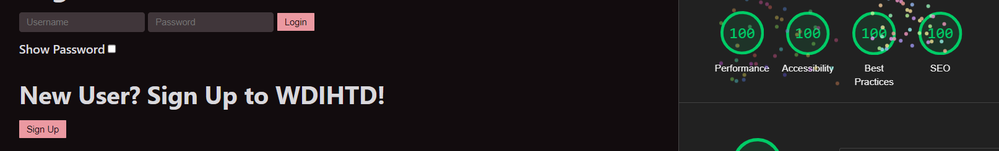

Assignment 3 - Persistence: Two-tier Web Application with Database, Express server, and CSS template
---

## What do I have to do?

https://a3-sean-arackal.glitch.me/

Include a very brief summary of your project here. Images are encouraged, along with concise, high-level text. Be sure to include:

Access:
Username: cs4241
Password: admin

---

### The goal of the application
- To increase productivity by tracking and managing the tasks you have to complete

### Challenges faced in realizing the application
- The main challenges were integrating OAuth for authentication, transitioning the Node.js HTTP server to Express, configuring the database, and deploying the application to a new host.

### Authentication Strategy 
-  authenticate users by comparing their usernames and passwords to the ones in my mongodb server

### CSS Framework

- sakura (sakura-vader)

### Express middleware packageS

- asdasd

---

## Deliverables
> Proper naming convention for the PR

> README contains required information

> Use of HTML form to gather user data

> Users can add, edit and delete data

> Makes server requests using fetch

> Implements and styles page using a CSS framework

> Data is persistent by the use of mongodb

> Server uses express and mongodb middleware

> Displays data related to a particular user

## Technical Achievements
- **Tech Achievement 2**: (5 points) Instead of Glitch, host your site on a different service like Heroku or Digital Ocean. Make sure to describe this a bit in your README. What was better about using the service you chose as compared to Glitch? What (if anything) was worse?

- **Tech Achievement 3**: Got 100% in all four lighthouse tests required for this assignment.

## Design/Evaluation Achievements
- **Design Achievement 1**: 
> Writing for Web Accessibility
1. Provide informative, unique page titles
2. Use headings to convey meaning and structure
3. Keep content clear and concise
> Designing for Web Accessibility
4. Provide sufficient contrast between foreground and background
5. Ensure that interactive elements are easy to identify
6. Provide clear and consistent navigation options: Ensured that navigation across pages within a website has consistent naming, styling, and positioning.
7. Ensure that form elements include clearly associated labels
8. Provide easily identifiable feedback
9. Create designs for different viewport sizes
10. Create designs for different viewport sizes
> Developing for Web Accessibility
11. Associate a label with every form control
12. Ensure that all interactive elements are keyboard accessible

- **Design Achievement 2**: Contrast, Repetition, Alignment and Proximity principles: Which element received the most emphasis (contrast) on each page?
 How did you use proximity to organize the visual information on your page? 
 What design elements (colors, fonts, layouts, etc.) did you use repeatedly throughout your site? 
 How did you use alignment to organize information and/or increase contrast for particular elements