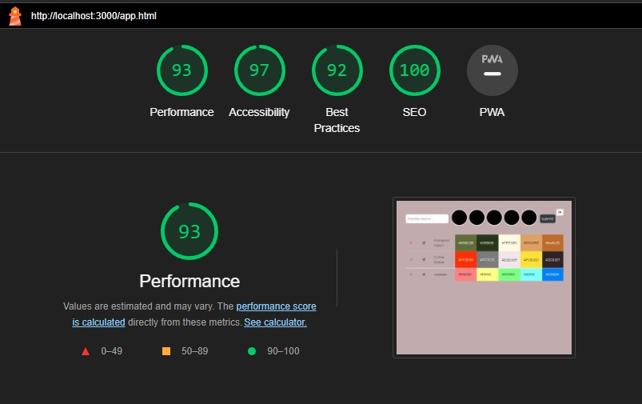

## Color Palette Bank
glitch: http://a3-ryan-rabbitt.glitch.me

Logins: 
User: test, Pass: test
User: yeha, Pass: wahoo

The goal of this application is to provide a user interface for adding color palettes and editing existing ones. 
The biggest challenge I faced was having multiple pages with the login and main app pages, as I couldn't figure out how to redirect to a new page. I ended up handling it in the app javascript rather than on the server side. Another challenge I faced was having dynamically generated edit forms for each element, as I had to figure out how to handle the form fields with multiple forms on the page.

For authentication, I ended up just checking if the username/password pair matches with an element in the mongodb as it was the easiest to achieve given the time constraint. 

I used the Bootstrap CSS framework, as I am already familiar with it from personal projects.
I left some of my CSS from A2 for this application, mainly the styling for the table elements, as trying to translate to Bootstrap's classes would be difficult since the table is dynamically generated in Javascript. I also kept my styling for the color pickers on the main form, since Bootstrap doesn't have support for styling that type of form input. 

Express middleware packages:
- cookie-session: Uses cookies to store whether a user is logged in, and stores the currently logged in user's username.
- json: parses requests with JSON payloads.
- urlencoded: parses requests with url-encoded payloads
- static: serves the static files in the public directory

Lighthouse: 

## Technical Achievements
- **Tech Achievement 1**: Added dismissable alerts using Bootstrap's Alert component, which are generated in 3 places: the login screen when the user is not authenticated, from the name field if the name is not filled out, and when there is an error with adding an object to the database. 
- **Tech Achievement 2**: Added a logout button that removes the user from cookies and redirects to the login screen. 

### Design/Evaluation Achievements
- **Design Achievement 1**: Added a favicon to each page that fits the purpose of the website (from Wikimedia Commons, src: https://upload.wikimedia.org/wikipedia/commons/9/99/Info-Icon.png)

