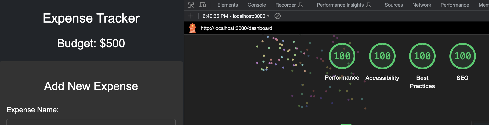

# **Expense Tracker - Ryan Kornitsky**

# Hosted site : [a3-ryan-kornitsky](http://18.117.113.195:3000/)

The Expense Tracker is a web application designed to help users manage their budgets efficiently. It allows users to keep track of their expenses, view a list of all their transactions, and perform various actions such as adding, updating, and deleting expenses.

 

## **Project Overview**

 

### **Goal of the Application**

The goal of the Expense Tracker is to provide users with a simple and effective tool for managing their expenses and budgets. I developed this application to help users easily track their spending, update expense details, and view their remaining budget in one convenient interface.

### **Challenges Faced**

One of the main challenges in this project was implementing OAuth authentication with GitHub. It required setting up OAuth credentials, handling authentication callbacks, and securely managing user sessions. Additionally, ensuring that the application met accessibility and performance standards posed its own set of challenges. Converting my Node.js HTTP server to Express was not as bad as I expected and configuring the database also wasn't too bad.

### **Authentication Strategy**

For user authentication, I chose to implement GitHub OAuth. This strategy was selected because it offers a secure and convenient way for users to log in using their existing GitHub accounts. It simplifies the registration process and aligns with the developer-friendly nature of the project. Also, I thought it was nice that I didn't need to make a whole new login page since I would just reroute to auth/github and back to /dashboard on being authenticated. When you log in, you should only see data that is associated with your GitHub ID, so you will not see other peoples data.

### **CSS Framework**

To style the application, I utilized Bootstrap 5. I may not have utilized it to its fullest potential, but I found it most useful for formatting all the CSS for me (like setting up flexboxes) and not so much the visuals, since I could already do that myself. Making a bunch of flexboxes and making sure everything adjusts to the screen size takes the most time for me to implement with my own CSS, which Bootstrap does a lot of the heavy lifting with. I only had to make a couple minor CSS adjustments to change the colors to ones I liked better.

### **Custom CSS Modifications**

The only CSS modifications I did were to the colors of the input fields since I wanted them to be a specific color.

### **Express Middleware Packages**

The project utilizes several Express middleware packages to enhance functionality and security. Here are the six middleware packages used, along with brief descriptions:

1. `body-parser`: This middleware is used to parse JSON requests, making it easier to work with incoming data.

2. `express-session`: Responsible for managing user sessions, ensuring that users remain authenticated throughout their interactions with the application.

3. `passport`: This middleware is essential for implementing GitHub OAuth authentication, enabling users to log in using their GitHub accounts.

4. `compression` : This middleware optimizes web applications by compressing server responses before sending them to clients. It reduces the size of data transferred over the network, resulting in faster load times and reduced bandwidth usage. 

5. `cors` : It is a middleware that manages cross-origin HTTP requests in web applications and allows or restricts requests made to a different domain (origin) than the one serving the web page.

6. `express-static`: Used to serve static files like HTML, CSS, and JavaScript, ensuring smooth frontend functionality.

### **Technical Achievements**

1. **OAuth Authentication**: Implemented OAuth authentication using GitHub OAuth for secure user logins.

2. **Hosting on AWS EC2**: The application is hosted on EC2, providing a reliable hosting service. Some of the hosting sites that I tried were really annoying to get setup and a lot of them required payment. It made me appreciate how simple Glitch is. I probably wouldn't have done EC2 if Akim didn't help me set it up because its more complicated than others, but it seems to work great and I have more control this way.

3. **Lighthouse Test Scores**: Achieved 100% scores in all four Lighthouse tests, ensuring excellent performance, accessibility, best practices, and SEO. See the image here:

### **Design/UX Achievements**

 

1. ## **12 tips**: 
## **Writing Tips**:

- **Use headings to convey meaning and structure:** Using `<h1>` for the main title and `<h2>` for the section titles in your HTML code helps convey the structure and the different sections of your application well.

- **Provide clear instructions:** Label elements properly to give clear instructions to users. For instance, labels like "Expense Name" and "Expense Amount" in your form sections clearly guide the user on what inputs are required.

- **Keep content clear and concise:** The button texts such as "Add Expense" and "Update Changes" clearly indicate their functionality, maintaining clarity and conciseness.

## **Designing Tips**:

- **Provide sufficient contrast between foreground and background:** The `bg-dark` and `text-white` classes and similar styles provide a good contrast between the text and the background, facilitating readability.

- **Don't use color alone to convey information:** While color is utilized to differentiate between different elements (like different buttons), text is also used to convey information, adhering to this tip.

- **Ensure that interactive elements are easy to identify:** Buttons have been styled distinctly, and interactive elements such as input fields have a different style from non-interactive elements, making them easy to identify.

- **Ensure that form elements include clearly associated labels:** Every input field in the form sections has an associated label element that clearly describes its purpose, which assists users in filling out the forms accurately.

- **Use headings and spacing to group related content:** Group related content under respective headings and provide ample spacing between different sections to offer a clean and structured layout.

- **Create designs for different viewport sizes:** The `meta` tag with `name="viewport"` and `content="width=device-width, initial-scale=1.0"` ensures the web page is optimized for various viewport sizes. Also if you switch to mobile view, the content of the website adjusts accordingly.

## **Developing Tips**:

- **Associate a label with every form control:** The label elements in your form sections are properly associated with respective input elements using the `for` attribute, aligning with this tip.

- **Identify page language and language changes:** The `html` element specifies the language as English using `lang="en"`, helping in accessibility and SEO.

- **Reflect the reading order in the code order:** The HTML structure is organized in a way that the code order logically follows the reading order, enhancing accessibility.

 

2. ## **CRAP Principles**:

**Contrast:**
The website primarily utilizes a dark theme background with elements such as forms and lists visually differentiated through contrasting background colors such as "#333". This serves to highlight these central interactive elements effectively, giving them maximum emphasis. Text elements follow a white color scheme, offering a high degree of contrast against the dark background, ensuring readability and focus. The heading "Expense Tracker" on the homepage stands out prominently due to the larger font size, establishing it as the most emphatic element on the page. Moreover, different states of buttons (like adding or updating an expense) change not just functionally but visually, leveraging contrast to indicate their current state.

**Repetition:**
Repetition is primarily seen in the repeated use of a specific color palette consisting of dark hues — the background is dark, with lighter tones used in text and form backgrounds to maintain a harmonious visual flow. The typography, utilizing the Arial, sans-serif font family, remains consistent throughout, instilling a sense of uniformity and coherence across different sections of the website. The structure of the expense listing, characterized by a repeated pattern of displaying expense details followed by edit and delete buttons, reinforces user familiarity as they interact with different list items, facilitating a seamless user experience. The rounded corners of the buttons and form fields are also repeated, fostering visual harmony.

**Alignment:**
Alignment is judiciously applied to structure content on the web page, resulting in an organized and visually pleasing layout. Each section, whether it is the "Add New Expense" or "Update Existing Expense," follows a centralized alignment, directing the user's attention to the middle of the page. The form fields and buttons within each section are left-aligned, creating a strong vertical axis that aids in readability and eases form completion. The expense list items adhere to a flex-column alignment, harmoniously organizing information and the associated actions (edit and delete) in a columnar fashion, facilitating quick visual association and action.

**Proximity:**
Proximity is leveraged to group related content logically and create distinct visual units that guide the user effortlessly through the information landscape. In the form sections, related input fields are grouped closely, differentiated by a moderate spacing to avoid visual clutter while retaining a sense of unity. The heading of each section is placed closely with the pertaining fields, reinforcing their association. The expense list items follow a similar strategy, where details pertaining to a single expense are grouped closely, establishing a clear visual boundary between individual list items. This approach not only aids in quickly discerning related elements but also minimizes cognitive overload by preventing a chaotic scattering of unrelated elements, thereby fostering a user-friendly interface.