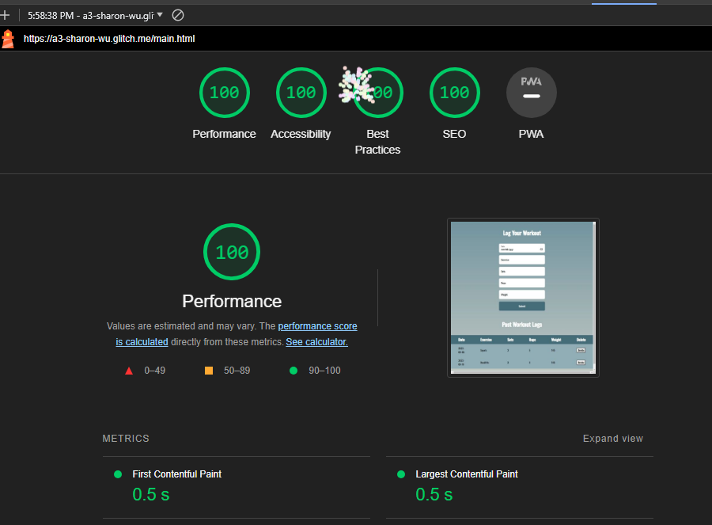
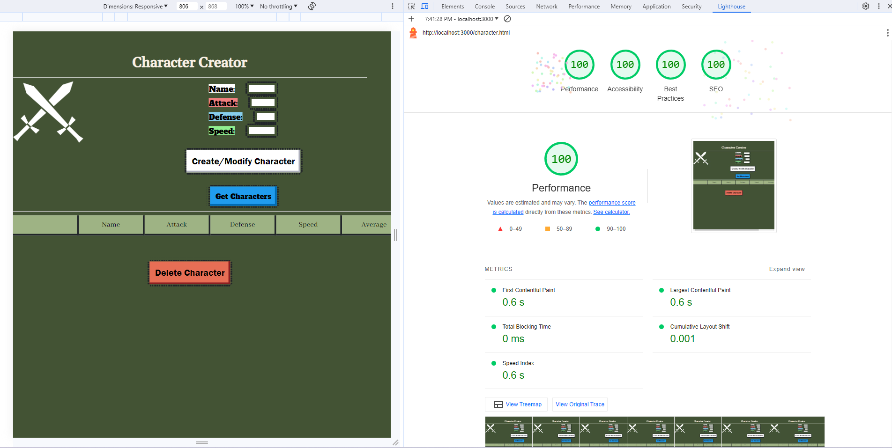

Assignment 3 - Persistence: Two-tier Web Application with Database, Express server, and CSS template
===

Due: September 22nd, by 11:59 AM.

This assignnment continues where we left off, extending it to use the most popular Node.js server framework (express), 
a database (mongodb), and a CSS application framework / template of your choice (Boostrap, Material Design, Semantic UI, Pure etc.)

Baseline Requirements
---

Your application is required to implement the following functionalities:

- a `Server`, created using Express (no alternatives will be accepted for this assignment)
- a `Results` functionality which shows all data associated with a logged in user (except passwords)
- a `Form/Entry` functionality which allows users to add, modify, and delete data items (must be all three!) associated with their user name / account. 
- Persistent data storage in between server sessions using [mongodb](https://www.mongodb.com/cloud/atlas) (you *must* use mongodb for this assignment).
- Use of a [CSS framework or template](https://github.com/troxler/awesome-css-frameworks). 
This should do the bulk of your styling/CSS for you and be appropriate to your application. 
For example, don't use [NES.css](https://nostalgic-css.github.io/NES.css/) (which is awesome!) unless you're creating a game or some type of retro 80s site.

Your application is required to demonstrate the use of the following concepts:  

HTML:  
- HTML input tags and form fields of various flavors (`<textarea>`, `<input>`, checkboxes, radio buttons etc.)
- HTML that can display all data *for a particular authenticated user*. Note that this is different from the last assignnment, which required the display of all data in memory on the server.

Note that it might make sense to have two pages for this assignment, one that handles login / authentication, and one that contains the rest of your application.
For example, when visiting the home page for the assignment, users could be presented with a login form. After submitting the login form, if the login is 
successful, they are taken to the main application. If they fail, they are sent back to the login to try again. For this assignment, it is acceptable to simply create 
new user accounts upon login if none exist, however, you must alert your users to this fact.  

CSS:  
- CSS styling should primarily be provided by your chosen template/framework. 
Oftentimes a great deal of care has been put into designing CSS templates; 
don't override their stylesheets unless you are extremely confident in your graphic design capabilities. 
The idea is to use CSS templates that give you a professional looking design aesthetic without requiring you to be a graphic designer yourself.

JavaScript:  
- At minimum, a small amount of front-end JavaScript to get / fetch data from the server. 
See the [previous assignment](https://github.com/cs-4241-23/shortstack) for reference.

Node.js:  
- A server using Express and a persistent database (mongodb).

General:  
- Your site should achieve at least 90% on the `Performance`, `Best Practices`, `Accessibility`, and `SEO` tests 
using Google [Lighthouse](https://developers.google.com/web/tools/lighthouse) (don't worry about the PWA test, and don't worry about scores for mobile devices).
Test early and often so that fixing problems doesn't lead to suffering at the end of the assignment. 

Deliverables
---

Do the following to complete this assignment:

1. Implement your project with the above requirements. I'd begin by converting your A2 assignment. First, change the server to use express. Then, modify the server to use mongodb instead of storing data locally. Last but not least, implement user accounts and login. User accounts and login is often the hardest part of this assignment, so budget your time accordingly.
2. If you developed your project locally, deploy your project to Glitch (unless completing the alternative server technical acheivement described below), and fill in the appropriate fields in your package.json file.
3. Test your project to make sure that when someone goes to your main page on Glitch (or an alternative server), it displays correctly.
4. Ensure that your project has the proper naming scheme `a3-yourfirstname-yourlastname` so we can find it.
5. Fork this repository and modify the README to the specifications below.
6. Create and submit a Pull Request to the original repo. Name the pull request using the following template: `a3-firstname-lastname`.

Acheivements
---

Below are suggested technical and design achievements. You can use these to help boost your grade up to an A and customize the 
assignment to your personal interests, for a maximum twenty additional points and a maximum grade of a 100%. 
These are recommended acheivements, but feel free to create/implement your own... just make sure you thoroughly describe what you did in your README, 
why it was challenging, and how many points you think the achievement should be worth. 
ALL ACHIEVEMENTS MUST BE DESCRIBED IN YOUR README IN ORDER TO GET CREDIT FOR THEM.

*Technical*
- (10 points) Implement OAuth authentication, perhaps with a library like [passport.js](http://www.passportjs.org/). 
*You must either use Github authenticaion or provide a username/password to access a dummy account*. 
Course staff cannot be expected, for example, to have a personal Facebook, Google, or Twitter account to use when grading this assignment. 
Please contact the course staff if you have any questions about this. THIS IS THE HARDEST ACHEIVEMENT OFFERED IN WEBWARE. You have been warned!  
- (5 points) Instead of Glitch, host your site on a different service like [Heroku](https://www.heroku.com) or [Digital Ocean](https://www.digitalocean.com). Make sure to describe this a bit in your README. What was better about using the service you chose as compared to Glitch? What (if anything) was worse? 
- (5 points) Get 100% (not 98%, not 99%, but 100%) in all four lighthouse tests required for this assignment.  

*Design/UX*
- (10 points) Make your site accessible using the [resources and hints available from the W3C](https://www.w3.org/WAI/), Implement/follow twelve tips from their [tips for writing](https://www.w3.org/WAI/tips/writing/), [tips for designing](https://www.w3.org/WAI/tips/designing/), and [tips for development](https://www.w3.org/WAI/tips/developing/). *Note that all twelve must require active work on your part*. 
For example, even though your page will most likely not have a captcha, you don't get this as one of your twelve tips to follow because you're effectively 
getting it "for free" without having to actively change anything about your site. 
Contact the course staff if you have any questions about what qualifies and doesn't qualify in this regard. 
List each tip that you followed and describe what you did to follow it in your site.
- (5 points) Describe how your site uses the CRAP principles in the Non-Designer's Design Book readings. 
Which element received the most emphasis (contrast) on each page? 
How did you use proximity to organize the visual information on your page? 
What design elements (colors, fonts, layouts, etc.) did you use repeatedly throughout your site? 
How did you use alignment to organize information and/or increase contrast for particular elements. 
Write a paragraph of at least 125 words *for each of four principles* (four paragraphs, 500 words in total). 

Sample Readme (delete the above when you're ready to submit, and modify the below so with your links and descriptions)
---
I received a 12 hour extension for Assignment 3 from Professor Roberts, so this project was submitted on time. 
## Character creator:

your glitch (or alternative server) link e.g. http://a3-charlie-roberts.glitch.me

Include a very brief summary of your project here. Images are encouraged, along with concise, high-level text. Be sure to include:

- the goal of the application
    The goal of this application was to create something that mimicked old school TTRPGS and video games. I went with a character creator because of my love of dungeons and dragons and the fact that it worked well with the requirements of the original projects. 

- challenges you faced in realizing the application
    The authentication was a challenge, especially testing server-side API. I used postman to test the server side API before using it from the client, which helped speed up the debugging in the server side. Also, I chose to use Model-Controller-Boundary organization for the server because it helped keep the code simple. 

- what authentication strategy you chose to use and why (choosing one because it seemed the easiest to implement is perfectly acceptable)
    I used JSON Web Token (jsonwebtoken v9.0.2) along with bcryptjs (a library for node.js) for encryption. While I was reading about authentication, I learned about JSON Web Token, and it looked extremely secure, with the token passing after the initial login. I was able to implement it using the sample provided for the JSON web token.

- what CSS framework you used and why
    I used NES.css. What caught my eye is that the professor had mentioned not to use it for non-game aplications. However, my application is to create characters, a very game related concept,  so I decided to test out NES. I was happy with the result. 

- the five Express middleware packages you used and a short (one sentence) summary of what each one does. If you use a custom function for *one* (and one alone) middleware please add a little more detail about what it does.
    I used the following middleware packages:
    1. express: Web application framework for node.js
    2. Mongoose: Node.js object modeling library for MongoDB
    3. jsonwebtoken: Node.js libraray that implements JSON Web Token (JWT), an open standard (RFC 7519) that defines a compact and self-contained way for securely transmitting information between parties as a JSON object.  
    4. bcrypt.js: Node.js library that implements Bcrypt, the most popular and safest one-way hashing functions for passwords.
    5. Cors: CORS is a node.js package for providing a Connect/Express middleware that can be used to enable CORS (Cross-Origin Resource Sharing (CORS) is an HTTP-header based mechanism that allows a server to indicate any origins (domain, scheme, or port) other than its own from which a browser should permit loading resources) with various options
   6. mime.js: A comprehensive library for mime-type mapping
## Technical Achievements

- **Tech Achievement 2**: 

- **Tech Achievement 3**: Here is proof that my website achieved a 100 on all 4 lighthouse attributes: 

### Design/Evaluation Achievements

- **Design Achievement 2**: How my site uses the CRAP principles: 
Contrast: 
For the login page: The most contrast on the login page belongs to the label + input text for the username. That was my intention, as the Username is the focal point for the sign-on- it is necessary to access the characters you’ve created and you really can’t do anything without it. Sign in, sign up, and the password all rely on the username the most out of any other element, so placing it as the most prominent feature in contrast to the other colors is the most sensible option. 
For the content page: The most contrast on my content page belongs to the stats labels + inputs. Creating a character is the whole fun of the page, so I decided to place the focus on that more than anything. The Name, Attack, Defense, and Speed stats are all highlighted in striking colors to represent that those are the most prominent features of the page and they are what should be looked at before anything else in order to make a character.

Repetition:

Repetition is a common element among my page, as that Is how I lay out familiarity. 

The login page demonstrates its repetition very clearly, through the use of both side by side sign in/sign up buttons and username/password fields.For the content page, however- Starting from the very beginning, even the images on the page are repeated on either side to establish a sort of atmosphere. However, the primary example of this is the stats labels + inputs again. While they all may have different color labels, it is shown that they are all intertwined through the same usage of font + input color. This theme continues through the buttons- while I made the get font different to show that it wasn’t directly about creating or deleting and rather about just getting existing values from the page, both create/modify and delete have identical fonts to show that they’re part of the same cycle. Even within the table the font size/color/spacing are repeated to show that they are all part of the same table. 

Alignment:

For my pages, I tend to prefer a center alignment for important elements. 

For the login page: This page is simple, but the username feeds into the password, and both of those are used to either create a user or log in with a user. 

 For the content page: On my page, it is very obvious to notice that the elements link neatly to each other in a top down manner. The leading elements, like the title and images, are away from the main content to provide the atmosphere. The stats + labels very obviously feed into the create character/modify character button, as they are a necessary prerequisite. The get character button is placed in close proximity to the table, as to show that it is the way to access your previously stored characters on load in. Mirroring that, the delete character button, which removes elements, is at the bottom to provide an antithesis to the create/modify/get buttons, which all cause elements to appear. 

Proximity:

For the login page: This features important elements of grouping. Both username and password are visually similar and side by side, and this is the same with the sign in and sign up buttons as well. These are all visually pleasing, fitting within a neat rectangle in the center of the page.

For the content page: The content page similarly fits these elements, with all the stats and inputs focused together near the top. That is placed in close proximity to the create button, which I chose to have colored white to represent the fact that the stats and create button together were part of a whole. Beyond this, the green table is flanked by red and blue buttons to show that these would fundamentally alter the view on the page if they were so used. The Table itself can feature many elements if the user so chooses, all of which have the same font, font color, and spacing between elements.

