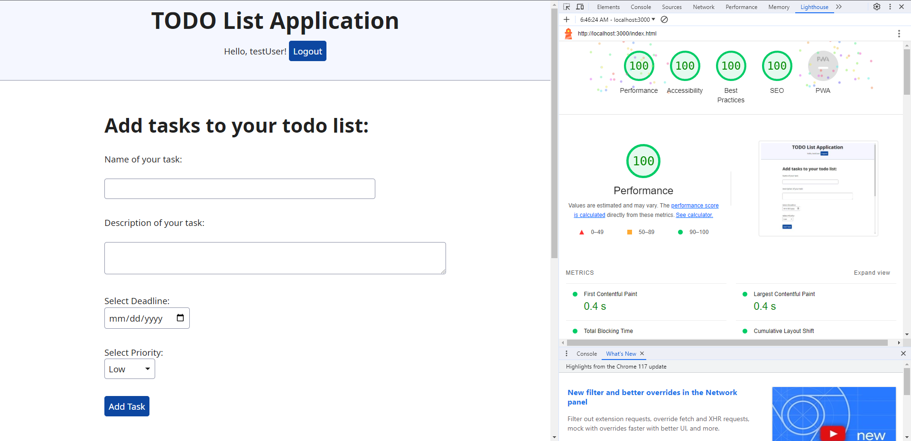

## TODO List Application

Glitch Link: http://a3-charlie-roberts.glitch.me

This application uses express as the server backend and mongodb as the database. The server queries the database for all the tasks that belong to the currently logged in user using the default mongodb Collections API driver. The application allows the users to add, delete, modify / update tasks that they need to get done. It constantly shows all of tasks belonging to the current logged in user on the login page in a HTML table format. In order to edit, all of the current data related to the task is loaded back into the HTML form element and then the task information is updated to the database when the user clicks the "Update Task" button. Some challenges I faced were setting up the logic for some of the express routes and the mongodb database integration. I faced a lot difficulty setting up the login mechanism, especially in regards to saving the session cookie of the authenticated user, and protecting all of the routes that required authentication before accessing. The authetication strategy that I used was the basic username and password login because that seemed like the most feasible. The CSS framework that I used was the Simple.css framework because it had a simple and clean design that fit the organizational theme of my application well. I did not make any custom changes to override any of the CSS applied by the framework. The middleware packages I used were express-session to manage and store the authentication cookie on the client after the user has logged in. Other authentication middleware used was a middleware function that I created on my own called ensureAuthenticated which was placed before most routes other than the login route in order to prevent access without a valid session cookie. If the user tries to access a restricted resource, they are immediately redirected to the login page due to this middleware.

## How to Log In

The application is designed to automatically create an account for any username that you type in if that username does not already exist in the database for the first time that someone logs in. If you would like to use a default demo account to access the application, please use these credentials provided here:

username: testUser  
password: testPass

## Technical Achievements

- **Tech Achievement 1**: I got a 100% on all four Lighthouse tests (at least on localhost)

### Design/Evaluation Achievements

None
