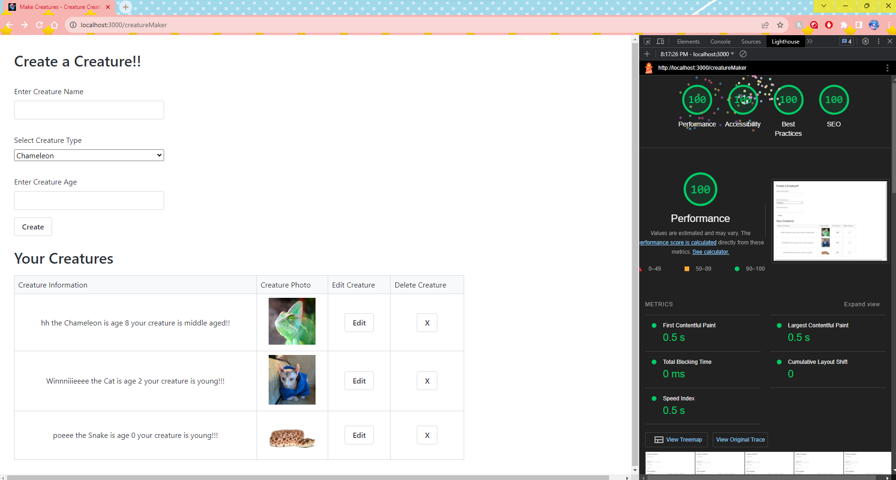

Assignment 3 - Persistence: Two-tier Web Application with Database, Express server, and CSS template
===
Mirandi McCormick
mlmccormick
cabbag3

## Creature Creator

your glitch (or alternative server) link e.g. http://a3-charlie-roberts.glitch.me

- My application has 3 pages: login, create account, and the main creature creator page after successful login.
- A big challenge I faced was getting res.render to work, I was using .handlebars extention, and the link would change, but the new page would not render. I was able to fix this by using hbs and the extention .hbs instead after seeing lots of people on stackoverflow using that version and not the .handlebars version.
- The authentication strategy I use is checking for a "Login" entry in the database that has the entered User and Pass, I found that to be the easiest way.
- I used TurretCSS, it seemed simple, straightforward, and I liked the page they provided for how to use their CSS package and the different color, elements, and etc. that comes with it. I made no custom modifications/I have no css file of my own.
- I used the cookies and the handlebars which were listed in the setup instructions and covered in class. I then also used many get and post middlewares for the differnt pages my app has, I also have middleware for deleting, adding, and editing entries.

## Technical Achievements
- **Tech Achievement 1**: I scored a 100 in all 4 required lighthouse tests, screenshot attached.

### Design/Evaluation Achievements
- **Design Achievement 1**: I followed 12 of the tips from W3C

Design:
- Tip - Provide sufficient contrast between foreground and background - the CSS I use defaults to the classic white background and black text, which is as much contrast as it gets.
- Tip - Provide clear and consistent navigation options - I have a link on the login page to the signup page, and a link on the signup page to the login page. Both are in basically the same location and use similar words (click here) to signify that it is a link to another page.
- Tip - Ensure that form elements include clearly associated labels - all my fields have associated lables which tell the user what information goes in which box and they are not positioned too - far away from the boxes
- Tip - Use headings and spacing to group related content - I use this on the creature maker page where I have a heading that separates where you make a creature and a header that separates your already creatued creatures. I also use a table to separate the creatures created and separate the fields of the creature and the fields when editing the creature

Writing:
- Tip - Provide informative, unique page titles - For each page I have what you do on the page, followed by the site name, for the page titles
- Tip - Use headings to convey meaning and structure - For each page I have a heading that says what you do on the form of the page, and for the creature creator page I have two headings which list the form to make creatures, and where you view your created creatures
- Tip - Make link text meaningful - I have a link to go from login to create account, and to go from create account to login, both links list the purpose/site you visit, and mention "click here"
- Tip - Provide clear instructions - I have errors and success messages that pop up. I have an error for unsuccessful login and for a taken username when creating an account. Also the css that I am using has a built in popup warning when you try to submit a username/password/creature name that is too short or too long

Developing:
- Tip - Include alternative text for images - I have alt text available for the creature images I use which tells what kind of animal the image is showing
- Tip - Help users avoid and correct mistakes - I have error messages for when a username is already taken, or when a login fails due to not finding the user and pass. There are also popups which say when a user tries to enter something in a field and it is too long or too short
- Tip - Reflect the reading order in the code order - I use this for my forms (reading and entering information top to bottom) and when a user is looking at and editing/deleting their creatures (listed left to right since there can be multiple creatures and that would make the top to bottom format confusing for the user)
- Tip - Ensure that all interactive elements are keyboard accessible - all my fields and buttons are keyboard accessible, can use tab and enter to select and "click" items without the need for a mouse, I don't use any listeners for "on click" I use form submissions so this avoids the issue of on click

