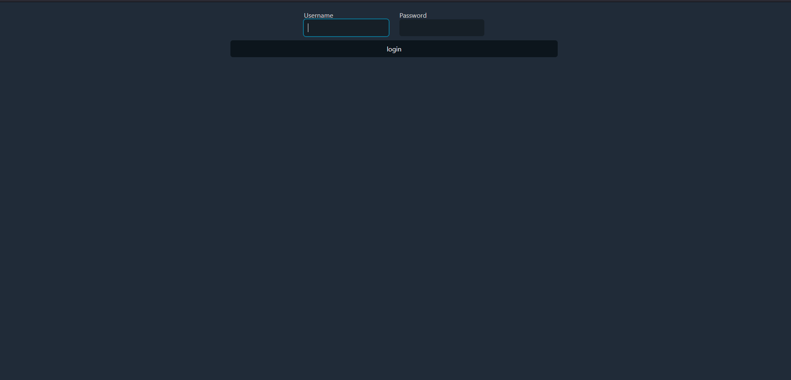

## What to Do
https://a3-bdvuong.glitch.me/
The goal of my application was to keep track of tasks for one's everyday life. A lot of the challenges that I faced while realizing the application was on the back end of things, and how to store data effectively. As of right now there are two user accounts:
   Username:                  Password:
1. admin                      coolpassword
2. bdvuong                    brandonvuong

On the login page, you are able to log in with the above credentials, or create your own credentials. There is no sign-up button, however, when you enter a username that does not currently exist within the database, the server will automatically create one for you with the given password. There is currently no way to change a password unless I manually do it within mongoDB, which is something that would be cool to implement. I created simple authentication with username+password since it would be easy to do. I used water.css because blue is my favorite color. Since water.css tends to create a fixed size to the center of the page, I had to override it to keep the same formatting how I wanted the window to look. The five middleware packages that I used from express were json, static, and cookieSession.
JSON is used to automatically parse incoming bodies that would be JSON data. 
Static serves static files from the public directory, whenever a client requests a file, Express checks to see if the file exists within the directory then sends a response if it is found. 
Cookie-session allows us to manage session data using cookies.

Very simple login page, type a username + password and it will doublecheck with the database. 

Here we have the main page, the left side is a list of tasks that you have created, or just the add task button if there are no tasks.
The right side past the tan bar is where you can edit the body of your task.

your glitch (or alternative server) link e.g. http://a3-charlie-roberts.glitch.me

## Technical Achievements
- **Tech Achievement 1**: I was able to get 100% on all Google Lighthouse tests for this assignment.
