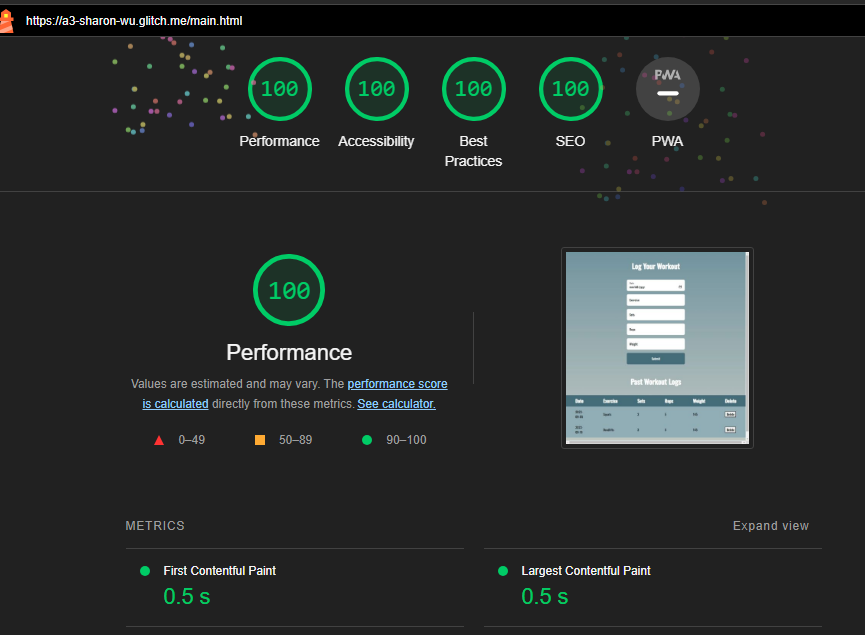

 ## IMPORTANT: 
 
 To test on an already created user,
 
 Username: John
 
 Password: 12345678
 
 should have 2 created characters already, visible by using the get characters button
 
 Username: Goliath
 
 Password: 12345678
 
 should have 1 created character already, visible by using the get characters button.
 
---
I received a 12 hour extension for Assignment 3 from Professor Roberts, so this project was submitted on time. 
## Character creator:

your glitch (or alternative server) link e.g. http://a3-charlie-roberts.glitch.me

Include a very brief summary of your project here. Images are encouraged, along with concise, high-level text. Be sure to include:

- the goal of the application
    The goal of this application was to create something that mimicked old school TTRPGS and video games. I went with a character creator because of my love of dungeons and dragons and the fact that it worked well with the requirements of the original projects. 

- challenges you faced in realizing the application
    The authentication was a challenge, especially testing server-side API. I used postman to test the server side API before using it from the client, which helped speed up the debugging in the server side. Also, I chose to use Model-Controller-Boundary organization for the server because it helped keep the code simple. 

- what authentication strategy you chose to use and why (choosing one because it seemed the easiest to implement is perfectly acceptable)
    I used JSON Web Token (jsonwebtoken v9.0.2) along with bcryptjs (a library for node.js) for encryption. While I was reading about authentication, I learned about JSON Web Token, and it looked extremely secure, with the token passing after the initial login. I was able to implement it using the sample provided for the JSON web token.

- what CSS framework you used and why
    I used NES.css. What caught my eye is that the professor had mentioned not to use it for non-game aplications. However, my application is to create characters, a very game related concept,  so I decided to test out NES. I was happy with the result. 

- the five Express middleware packages you used and a short (one sentence) summary of what each one does. If you use a custom function for *one* (and one alone) middleware please add a little more detail about what it does.
    I used the following middleware packages:
    1. express: Web application framework for node.js
    2. Mongoose: Node.js object modeling library for MongoDB
    3. jsonwebtoken: Node.js libraray that implements JSON Web Token (JWT), an open standard (RFC 7519) that defines a compact and self-contained way for securely transmitting information between parties as a JSON object.  
    4. bcrypt.js: Node.js library that implements Bcrypt, the most popular and safest one-way hashing functions for passwords.
    5. Cors: CORS is a node.js package for providing a Connect/Express middleware that can be used to enable CORS (Cross-Origin Resource Sharing (CORS) is an HTTP-header based mechanism that allows a server to indicate any origins (domain, scheme, or port) other than its own from which a browser should permit loading resources) with various options
   6. mime.js: A comprehensive library for mime-type mapping
## Technical Achievements

- **Tech Achievement 2**: 

- **Tech Achievement 3**: Here is proof that my website achieved a 100 on all 4 lighthouse attributes: 

### Design/Evaluation Achievements

- **Design Achievement 1**: Here are some W3C principles that I constructed my pages to follow. Only principles that took active work on my part are listed:

Principle 1: Provided Unique and Informative page titles between my two pages
Principle 2: Expanded all my image alternate text to be extra descriptive, beyond just simple words.
Principle 3: All my content is kept clear and concise, as it is fit within central flexboxes and containers that expand to fit the amount of content
Principle 4: I provided sufficient contrast between my foreground and background by changing the color of my buttons and their text. This was also needed for lighthouse to achieve 100%. 
Principle 5: I don’t use color alone to convey information. While I use color to differentiate a lot of things, such as my stats and buttons, the primary way for me to convey my images is through the text and positioning (which I elaborated a little bit for the CRAP principles), but the the color is still very helpful for distinguishing. 
Principle 6: I ensured that form elements include clearly associated labels. All my inputs and form elements have attached labels to distinguish them. This was also needed for lighthouse to achieve 100%.
Principle 7: I associate a label with every form control. All my labels are connected to inputs through the for="" tags. This was also needed for lighthouse to achieve 100%.
Principle 8: I identified page language and language changes on all my pages by adding <lang=en> on each page. All my pages are in English, so this was made easier.
Principle 9: I used mark-up to convey meaning and structure. Many of my elements have clear identifying mark-up through div tags. 
Principle 10: I reflected the reading order in the code order. Since my page was built in a very deliberate top down manner, which I elaborate on in the CRAP principles, my code order follows the reading order for my pages. 
Princple 11: I wrote code that adapts to the user’s technology. Through CSS styling, I made my page very extensively adaptive to technology, whether it was by adjusting the percentage width of certain elements like tables or containers, changing the alignment to follow a certain path on all devices, and setting the margins to have the elements fit in the same location on all devices. 
Principle 12: Use headings and spacing to group related content. I did not use headings extensively in my project, but I used spacing extensively, which is something I elaborate on in the CRAP principles. My pages are very deliberately and precisely spaced in order to have related groups featured prominently, including use of color grouping for the elements of the content page. 
Principle 13: Ensure that interactive elements are easy to identify: I used color in a striking manner to distinguish elements while keeping text as the identifying factor. 

- **Design Achievement 2**: How my site uses the CRAP principles: 
Contrast: 
For the login page: The most contrast on the login page belongs to the label + input text for the username. That was my intention, as the Username is the focal point for the sign-on- it is necessary to access the characters you’ve created and you really can’t do anything without it. Sign in, sign up, and the password all rely on the username the most out of any other element, so placing it as the most prominent feature in contrast to the other colors is the most sensible option. 
For the content page: The most contrast on my content page belongs to the stats labels + inputs. Creating a character is the whole fun of the page, so I decided to place the focus on that more than anything. The Name, Attack, Defense, and Speed stats are all highlighted in striking colors to represent that those are the most prominent features of the page and they are what should be looked at before anything else in order to make a character.

Repetition:

Repetition is a common element among my page, as that Is how I lay out familiarity. 

The login page demonstrates its repetition very clearly, through the use of both side by side sign in/sign up buttons and username/password fields.For the content page, however- Starting from the very beginning, even the images on the page are repeated on either side to establish a sort of atmosphere. However, the primary example of this is the stats labels + inputs again. While they all may have different color labels, it is shown that they are all intertwined through the same usage of font + input color. This theme continues through the buttons- while I made the get font different to show that it wasn’t directly about creating or deleting and rather about just getting existing values from the page, both create/modify and delete have identical fonts to show that they’re part of the same cycle. Even within the table the font size/color/spacing are repeated to show that they are all part of the same table. 

Alignment:

For my pages, I tend to prefer a center alignment for important elements. 

For the login page: This page is simple, but the username feeds into the password, and both of those are used to either create a user or log in with a user. 

 For the content page: On my page, it is very obvious to notice that the elements link neatly to each other in a top down manner. The leading elements, like the title and images, are away from the main content to provide the atmosphere. The stats + labels very obviously feed into the create character/modify character button, as they are a necessary prerequisite. The get character button is placed in close proximity to the table, as to show that it is the way to access your previously stored characters on load in. Mirroring that, the delete character button, which removes elements, is at the bottom to provide an antithesis to the create/modify/get buttons, which all cause elements to appear. 

Proximity:

For the login page: This features important elements of grouping. Both username and password are visually similar and side by side, and this is the same with the sign in and sign up buttons as well. These are all visually pleasing, fitting within a neat rectangle in the center of the page.

For the content page: The content page similarly fits these elements, with all the stats and inputs focused together near the top. That is placed in close proximity to the create button, which I chose to have colored white to represent the fact that the stats and create button together were part of a whole. Beyond this, the green table is flanked by red and blue buttons to show that these would fundamentally alter the view on the page if they were so used. The Table itself can feature many elements if the user so chooses, all of which have the same font, font color, and spacing between elements.

